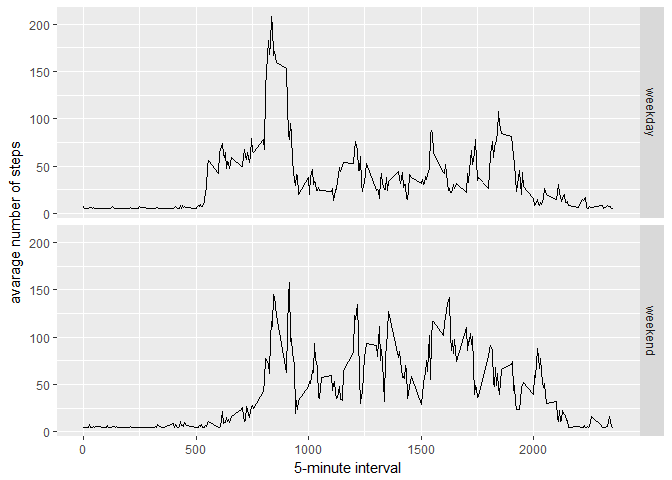

# Activity Monitoring Analysis


# Analysis Of Activity Data
By Alok Kumar (kumalok@gmail.com)
Date: 03 July 2017

## Reproducible Research: Peer Assessment 1


### Loading and preprocessing the data
##### 1. Load the data (i.e. read.csv())

```r
# create a data dir if it doesn't exist
if (!file.exists("./data")) {
	dir.create("./data")
}
# load file from URL to bz2 file in data dir
if (!file.exists("./data/activity_data.zip")) {
	file_url <- "https://d396qusza40orc.cloudfront.net/repdata%2Fdata%2Factivity.zip"
	destination_file <- "./data/activity_data.zip"
	download.file(file_url, destfile = destination_file)
}
# unzip bz2 file to csv
if (!file.exists("./data/activity.csv")) {
	file_path <- "./data/activity_data.zip"
	unzip(file_path, exdir = "./data")
}
activity_data <- read.csv('./data/activity.csv')
```


## What is mean total number of steps taken per day?

```r
steps_per_day <- tapply(activity_data$steps, activity_data$date, sum, na.rm=TRUE)
```

##### 1. Make a histogram of the total number of steps taken each day

```r
qplot(steps_per_day, xlab='Total steps per day', ylab='Frequency using binwith 500', binwidth=500)
```

<!-- -->

##### 2. Calculate and report the mean and median total number of steps taken per day

```r
stepsByDayMean <- mean(steps_per_day)
stepsByDayMedian <- median(steps_per_day)
```
* Mean: 9354.2295082
* Median:  10395

-----

## What is the average daily activity pattern?

```r
averageStepsPerTimeBlock <- aggregate(x=list(meanSteps=activity_data$steps), by=list(interval=activity_data$interval), FUN=mean, na.rm=TRUE)
```

##### 1. Make a time series plot

```r
ggplot(data=averageStepsPerTimeBlock, aes(x=interval, y=meanSteps)) +
    geom_line() +
    xlab("5-minute interval") +
    ylab("average number of steps taken") 
```

<!-- -->

##### 2. Which 5-minute interval, on average across all the days in the dataset, contains the maximum number of steps?

```r
mostSteps <- which.max(averageStepsPerTimeBlock$meanSteps)
timeMostSteps <-  gsub("([0-9]{1,2})([0-9]{2})", "\\1:\\2", averageStepsPerTimeBlock[mostSteps,'interval'])
```

* Most Steps at: 8:35

----

## Imputing missing values
##### 1. Calculate and report the total number of missing values in the dataset 

```r
numMissingValues <- length(which(is.na(activity_data$steps)))
```

* Number of missing values: 2304

##### 2. Devise a strategy for filling in all of the missing values in the dataset.
##### 3. Create a new dataset that is equal to the original dataset but with the missing data filled in.

```r
activityDataImputed <- activity_data
activityDataImputed$steps <- impute(activity_data$steps, fun=mean)
```


##### 4. Make a histogram of the total number of steps taken each day 

```r
stepsByDayImputed <- tapply(activityDataImputed$steps, activityDataImputed$date, sum)
qplot(stepsByDayImputed, xlab='Total steps per day (Imputed)', ylab='Frequency using binwith 500', binwidth=500)
```

<!-- -->

##### ... and Calculate and report the mean and median total number of steps taken per day. 

```r
stepsByDayMeanImputed <- mean(stepsByDayImputed)
stepsByDayMedianImputed <- median(stepsByDayImputed)
```
* Mean (Imputed): 1.0766189\times 10^{4}
* Median (Imputed):  1.0766189\times 10^{4}


----

## Are there differences in activity patterns between weekdays and weekends?
##### 1. Create a new factor variable in the dataset with two levels – “weekday” and “weekend” indicating whether a given date is a weekday or weekend day.


```r
activityDataImputed$dateType <-  ifelse(as.POSIXlt(activityDataImputed$date)$wday %in% c(0,6), 'weekend', 'weekday')
```

##### 2. Make a panel plot containing a time series plot


```r
averagedActivityDataImputed <- aggregate(steps ~ interval + dateType, data=activityDataImputed, mean)
ggplot(averagedActivityDataImputed, aes(interval, steps)) + 
    geom_line() + 
    facet_grid(dateType ~ .) +
    xlab("5-minute interval") + 
    ylab("avarage number of steps")
```

<!-- -->

